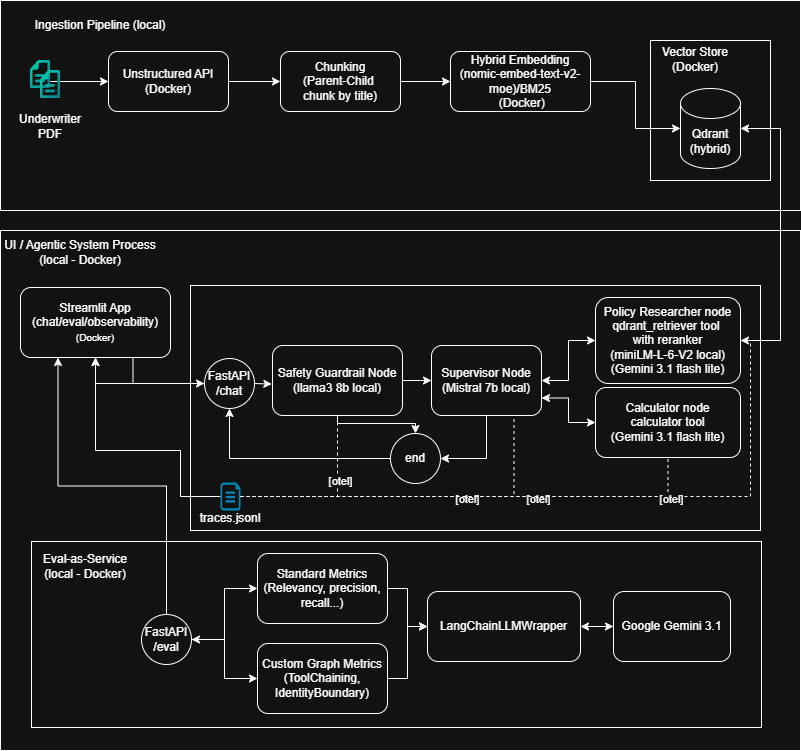

# 🛡️ P&C Underwriting Agent

**Accelerating Underwriting safely in a highly regulated environment.**

## The Business Case

### The Challenge
* **Manual Bottlenecks:** Underwriters spend excessive time searching complex, multi-layered Property & Causality PDF manuals to find base rates and policy guidelines.
* **The Generative AI Risk:** Standard RAG or naive LLM implementations are too risky for insurance. They hallucinate actuarial calculations and can be tricked via prompt injection into providing non-compliant policy advice.
* **Data Privacy Strategy:** Balancing the need for powerful LLM reasoning with strict data governance regarding proprietary underwriting rules.

### The Objective
Engineer a hybrid conversational agent that acts as a secure, deterministic assistant. It leverages local models for secure, zero-leakage routing and safety checks, while strategically utilizing cloud APIs for high-compute evaluation and reasoning tasks.

## 🏗️ Architecture Overview

The system is built on **LangGraph** for multi-agent orchestration, **Qdrant** for hybrid vector search, and **FastAPI** for the backend. It features integrated observability via OpenTelemetry and on-the-fly evaluations via DeepEval.




## 📋 Prerequisites

Before you begin, ensure you have the following installed:
*   **Docker** and **Docker Compose**
*   **Python 3.10+** (if running scripts locally)
*   *Optional:* NVIDIA Container Toolkit (if using local GPU for Ollama)

## ⚙️ Installation & Setup

1.  **Clone the repository:**
    ```bash
    git clone https://github.com/yourusername/autounderwriter.git
    cd autounderwriter
    ```

2.  **Configure Environment Variables:**
    Copy the provided example environment file and add your actual API keys.
    ```bash
    cp .env.example .env
    ```
    *Open `.env` and set your `GOOGLE_API_KEY` (or configure local Ollama models by setting `USE_GEMINI=false`).*

3.  **Pre-cache Models (Optional):**
    To speed up the initial Docker build, you can pre-download the Cross-Encoder models locally:
    ```bash
    pip install -r requirements.txt
    python utility/init_models.py
    ```

## 🚀 Usage

### 1. Start the Application Stack
Spin up the entire architecture (FastAPI, Qdrant, Ollama, DeepEval MCP, and UIs) using Docker Compose:
```bash
docker-compose up --build -d
```

### 2. Start the Ingestion Process
Before querying, you must populate the Qdrant vector database with your underwriting manuals and guidelines. Run the ingestion script inside the app container so it can access the internal services:
```bash
docker exec -it pnc_app python utility/ingest_manuals.py
```

### 3. Access the Interfaces
Once the containers are healthy, you can access the different components:
*   **Streamlit UI (Chat & Evals):** [http://localhost:8501](http://localhost:8501)
*   **Vite React UI:** [http://localhost:8086](http://localhost:8086)
*   **FastAPI Swagger Docs:** [http://localhost:8000/docs](http://localhost:8000/docs)

---

## 🧪 Evaluation & Telemetry

AutoUnderwriter natively tracks its performance:
*   **OpenTelemetry:** Execution spans and latencies are saved to `traces.jsonl`.
*   **DeepEval:** Live answers are scored for Faithfulness, Contextual Precision, and Answer Relevancy. Run the batch evaluator script via:
    ```bash
    python evaluate_agent.py
    ```
